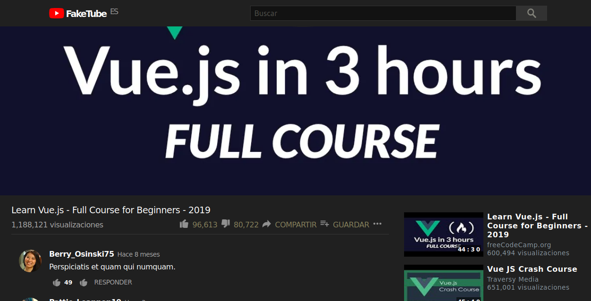

# El Faketube

Mi primera aplicación en Vue.js, creada para poder practicar y aprender más de V3 y Vuex.

## APIs

La aplicación usa la [API de YouTube](https://developers.google.com/youtube/v3) como herramienta inicial para obtener los videos. 

Los comentarios y otros componentes de la interfaz son *placeholders*, o información ficticia creados usando una combinación de la librería [Faker](https://www.npmjs.com/package/faker) y la API [Random Users](https://randomuser.me/).

## Cosas por mejorar 

* Ahora mismo la aplicación no refleja con exactitud el comportanmiento de YouTube, al ser solo una demostración, no ofrece la capacidad de elegir un vídeo de entre los resultados de busqueda.

* La mayoría de la lógica de los componentes pudiese ser extraida al utilizar mejor una de las nuevas características en V3: Composition. 

* Estructurar y estandarizar la aplicación siguiendo la Style Guide de Vue. 

## Hosting

Alojamiento gratuito y desarollo continuo provisto por [Netlify](https://www.netlify.com/).

